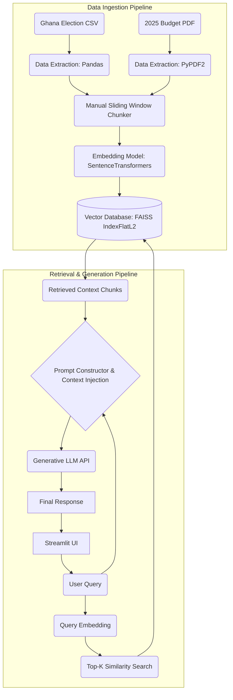

Name: Apryl Essilfua Poku
Roll Number: 10012300025

I chose a chunk size of 500 words because it provides enough context for the LLM to understand financial policies in the Budget PDF without exceeding the token limits of standard embedding models. The 50-word overlap ensures that critical sentences or data points that fall on the boundary of a chunk are not abruptly cut in half, preserving semantic meaning during retrieval.

