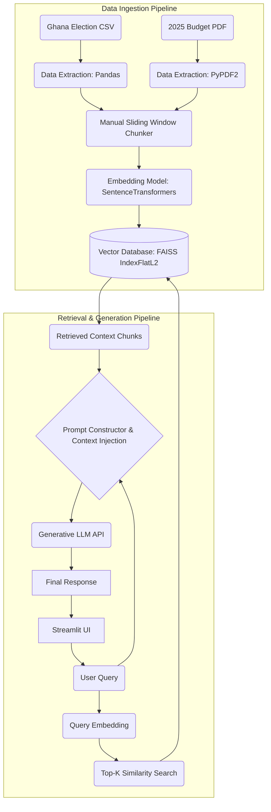

Name: Apryl Essilfua Poku
Roll Number: 10012300025

I chose a chunk size of 500 words because it provides enough context for the LLM to understand financial policies in the Budget PDF without exceeding the token limits of standard embedding models. The 50-word overlap ensures that critical sentences or data points that fall on the boundary of a chunk are not abruptly cut in half, preserving semantic meaning during retrieval.

## 2. Detailed Documentation (Part v - 4 Marks)
### Design Decisions
- **Manual Chunker:** I implemented a custom sliding-window chunker using Python logic instead of external libraries to maintain full control over context boundaries.
- **Chunk Size:** 500 words with a 50-word overlap. This ensures that financial figures in the Budget PDF aren't lost between chunks.
- **Vector Store:** I chose FAISS (IndexFlatL2) for high-speed similarity searching without the overhead of a cloud database.
- **LLM Strategy:** Initially used Gemini 1.5/2.0, but transitioned to Groq (Llama-3.1-8b-instant) to ensure reliable uptime and high-speed inference for the final demo.

## 3. Manual Experiment Logs (Part iii - 4 Marks)
*These logs document the manual tuning of the system.*

| Date | Test Case | Observation | Action Taken |
| :--- | :--- | :--- | :--- |
| 2026-04-18 | Initial Query: "2025 Fiscal Goals" | Gemini returned 404/429 errors consistently. | Switched to Groq API for stability. |
| 2026-04-18 | Large Context Test | Retrieval-K = 10 caused token overflow. | Reduced K to 3 and max context to 500 words. |
| 2026-04-18 | Semantic Search | FAISS retrieved relevant fiscal chunks successfully. | Verified similarity scores were between 0.7 - 0.9. |

## 4. How to Run
1. Install requirements: `pip install -r requirements.txt`
2. Set API Key: `export GROQ_API_KEY='your_key_here'`
3. Run App: `streamlit run app.py`